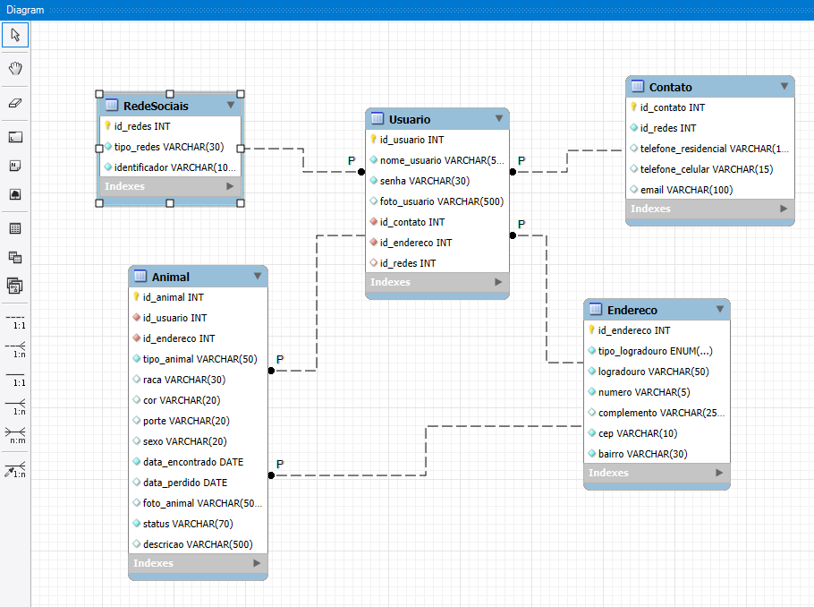

# 🐶 PetNaLeste - Projeto Integrador (SENAC)
PetNaLeste é um projeto social que tem como objetivo ajudar tutores da Zona Leste de São Paulo a reencontrarem seus animais de estimação perdidos. Por meio de uma plataforma acessível e colaborativa, o projeto conecta pessoas que perderam seus pets com aquelas que encontraram animais vagando pelas ruas ou abrigos da região.

O PetNaLeste promove a conscientização sobre a importância da identificação animal e cuidados com os pets, fortalecendo a rede de apoio entre moradores e protetores da causa animal.

---

## Objetivo do Projeto:

-
-

---

## Público Alvo:

-
-

---

## 🚀 Tecnologias Utilizadas:
(Norma SOLID)
- HTML 5
- CSS 3
- JavaScript
- Bootstrap
- TypeScript
- Node.js
- MySQL

---

## Configuração:

1. Instale as dependências com:

```bash 
npm install
```

2. Configure as variáveis de ambiente no arquivo .env, como:

```bash 
DB_HOST=localhost
DB_USER=root
DB_PASSWORD=sua_senha
DB_NAME=dbpethouse
JWT_SECRET=sua_chave_secreta
```

3. Inicie o servidor com:

```bash 
node index.js
```

---

## Banco de Dados PetNaLeste

### Tabela Usuario:

```bash 
CREATE TABLE `usuario` (
  `ID_Usuario` int(11) NOT NULL,
  `Tipo_usuario` enum('Cuidador','Tutor','Cuidador/Tutor') DEFAULT NULL,
  `Experiencia` text DEFAULT NULL,
  `Senha_usuario` varchar(100) NOT NULL,
  `Email_usuario` varchar(100) NOT NULL
);
```

### Tabela Animal:

```bash 
CREATE TABLE `usuario` (
  `ID_Usuario` int(11) NOT NULL,
  `Tipo_usuario` enum('Cuidador','Tutor','Cuidador/Tutor') DEFAULT NULL,
  `Experiencia` text DEFAULT NULL,
  `Senha_usuario` varchar(100) NOT NULL,
  `Email_usuario` varchar(100) NOT NULL
);
```

### Tabela Contato:

```bash 
CREATE TABLE `usuario` (
  `ID_Usuario` int(11) NOT NULL,
  `Tipo_usuario` enum('Cuidador','Tutor','Cuidador/Tutor') DEFAULT NULL,
  `Experiencia` text DEFAULT NULL,
  `Senha_usuario` varchar(100) NOT NULL,
  `Email_usuario` varchar(100) NOT NULL
);
```

### Tabela Endereço:

```bash 
CREATE TABLE `usuario` (
  `ID_Usuario` int(11) NOT NULL,
  `Tipo_usuario` enum('Cuidador','Tutor','Cuidador/Tutor') DEFAULT NULL,
  `Experiencia` text DEFAULT NULL,
  `Senha_usuario` varchar(100) NOT NULL,
  `Email_usuario` varchar(100) NOT NULL
);
```

### Tabela Redes Sociais:

```bash 
CREATE TABLE `usuario` (
  `ID_Usuario` int(11) NOT NULL,
  `Tipo_usuario` enum('Cuidador','Tutor','Cuidador/Tutor') DEFAULT NULL,
  `Experiencia` text DEFAULT NULL,
  `Senha_usuario` varchar(100) NOT NULL,
  `Email_usuario` varchar(100) NOT NULL
);
```

## CHAVES PRIMÁRIAS E ÍNDICES

```bash
```

```bash
```

```bash
```

```bash
```

## CHAVES ESTRANGEIRAS

```bash
```

```bash
```

```bash
```

```bash
```

---

## Seções 

- Home
- Encontre seu Pet
- Como Funciona
- Login/Cadastrar-se
- Revise e confirme sua reserva
- Contato

---

### "Diagrama do Banco de dados"

### ""

### ""

### ""

### ""

### ""


GitHub License

## Autores
Carlos Antonio,
Gabriel Lima,
Lucas Henrique,
Nathan Freire

---

## Status do Projeto

- Em Desenvolvimento

  ---

