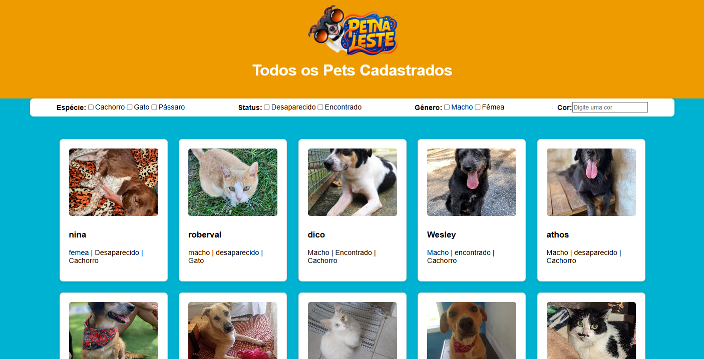

# 🐶 PetNaLeste - Projeto Integrador (SENAC)
PetNaLeste é um projeto social que tem como objetivo ajudar tutores da Zona Leste de São Paulo a reencontrarem seus animais de estimação perdidos. Por meio de uma plataforma acessível e colaborativa, o projeto conecta pessoas que perderam seus pets com aquelas que encontraram animais vagando pelas ruas ou abrigos da região.

O PetNaLeste promove a conscientização sobre a importância da identificação animal e cuidados com os pets, fortalecendo a rede de apoio entre moradores e protetores da causa animal.

---

## Objetivo do Projeto:

- Facilitar o reencontro entre tutores e animais de estimação perdidos na Zona Leste de São Paulo, por meio de uma plataforma digital colaborativa que conecta pessoas da comunidade.
- Promover a conscientização sobre a importância da identificação e cuidados com os pets, fortalecendo uma rede solidária entre moradores, protetores independentes e abrigos da região.

---

## Público Alvo:

- Tutores de animais de estimação que residem na Zona Leste de São Paulo e que estejam enfrentando a perda de seus pets.
- Moradores da região, protetores de animais, ONGs e pessoas que encontraram animais perdidos e desejam ajudar a promover o reencontro com seus donos.

---

## 🚀 Tecnologias Utilizadas:
(Norma SOLID)
- HTML 5
- CSS 3
- JavaScript
- Bootstrap
- TypeScript
- Node.js
- MySQL

---

## Configuração:

1. Instale as dependências com:

```bash 
npm install
```

2. Configure as variáveis de ambiente no arquivo .env, como:

```sql
DB_HOST=localhost
DB_USER=root
DB_PASSWORD=sua_senha
DB_NAME=dbpethouse
JWT_SECRET=sua_chave_secreta
```

3. Inicie o servidor com:

```bash 
node index.js
```

---

## Banco de Dados PetNaLeste

### Tabela Usuario:

```sql
CREATE TABLE `Usuario` (
    `id_usuario` INT(11) NOT NULL,
    `nome_usuario` VARCHAR(50) NOT NULL,
    `senha` VARCHAR(30) NOT NULL,
    `foto_usuario` VARCHAR(500) DEFAULT NULL,
    `id_contato` INT NOT NULL,
    `id_endereco` INT NOT NULL,
    `id_redes` INT DEFAULT NULL
);
```

### Tabela Animal:

```sql
CREATE TABLE `Animal` (
    `id_animal` INT(11) NOT NULL,
    `id_usuario` INT NOT NULL,
    `id_endereco` INT NOT NULL,
    `tipo_animal` VARCHAR(50) NOT NULL,
    `raca` VARCHAR(30) DEFAULT NULL,
    `cor` VARCHAR(20) DEFAULT NULL,
    `porte` VARCHAR(20) DEFAULT NULL,
    `sexo` VARCHAR(20) DEFAULT NULL,
    `data_encontrado` DATE NOT NULL,
    `data_perdido` DATE,
    `foto_animal` VARCHAR(500) DEFAULT NULL,
    `status` VARCHAR(70) NOT NULL,
    `descricao` VARCHAR(500) DEFAULT NULL
);
```

### Tabela Contato:

```sql
CREATE TABLE `Contato` (
    `id_contato` INT(11) NOT NULL,
    `id_redes` INT NOT NULL,
    `telefone_residencial` VARCHAR(15) DEFAULT NULL,
    `telefone_celular` VARCHAR(15) DEFAULT NULL,
    `email` VARCHAR(100) DEFAULT NULL
);
```

### Tabela Endereço:

```sql
CREATE TABLE `Endereco` (
    `id_endereco` INT(11) NOT NULL,
    `tipo_logradouro` ENUM('RUA','AVENIDA','ALAMEDA','TRAVESSA','VIELA','ESTRADA','RODOVIA') NOT NULL,
    `logradouro` VARCHAR(50) NOT NULL,
    `numero` VARCHAR(5) NOT NULL,
    `complemento` VARCHAR(255) DEFAULT NULL,
    `cep` VARCHAR(10) NOT NULL,
    `bairro` VARCHAR(30) NOT NULL
);
```

### Tabela Redes Sociais:

```sql 
CREATE TABLE `RedeSociais` (
    `id_redes` INT(11) NOT NULL,
    `tipo_redes` VARCHAR(30) NOT NULL,
    `identificador` VARCHAR(100) NOT NULL
);
```

## CHAVES PRIMÁRIAS E ÍNDICES

```sql
ALTER TABLE `Usuario`
  ADD PRIMARY KEY AUTO_INCREMENT (`id_usuario`),
  ADD UNIQUE KEY
```

```sql
ALTER TABLE `Animal`
  ADD PRIMARY KEY AUTO_INCREMENT (`id_animal`),
```

```sql
ALTER TABLE `Contato`
  ADD PRIMARY KEY AUTO_INCREMENT (`id_contato`),
```

```sql
ALTER TABLE `Endereco`
  ADD PRIMARY KEY AUTO_INCREMENT (`id_endereco`),
```

```sql
ALTER TABLE `RedeSociais`
  ADD PRIMARY KEY AUTO_INCREMENT (`id_redes`),
```

## CHAVES ESTRANGEIRAS (FOREIGN KEYS)

```sql
ALTER TABLE `Usuario`
    FOREIGN KEY (id_contato) REFERENCES Contato(id_contato),
    FOREIGN KEY (id_endereco) REFERENCES Endereco(id_endereco),
    FOREIGN KEY (id_redes) REFERENCES RedeSociais(id_redes)
```

```sql
ALTER TABLE `Animal`
    FOREIGN KEY (id_usuario) REFERENCES Usuario(id_usuario),
    FOREIGN KEY (id_endereco) REFERENCES Endereco(id_endereco)
```

---

## Seções 

- Home
- Perdi um Pet
- Achei um Pet
- Login
- Encontre seu Pet
- Fale Conosco
- Contato

---

### "Diagrama do Banco de dados"

### "Home do site"

### "Encontre seu Pet"

### "Todos os Pets"

### "Detalhe do Pet"

### "Login"

### "Perfil-1"

### "Perfil-2"

### "Ajuda"


## Colaboradores

<table>
  <tr>
    <td align="center">
      <a href="https://www.linkedin.com/in/carlosabcj/" target="_blank">
        <br>
        <sub><b>Carlos Antonio</b></sub>
      </a>
    </td>
    <td align="center">
      <a href="https://www.linkedin.com/in/gabriel-lima-a078182b3/" target="_blank">
        <br>
        <sub><b>Gabriel Lima</b></sub>
      </a>
    </td>
    <td align="center">
      <a href="https://www.linkedin.com/in/lucas-henrique-0148422b2/" target="_blank">
        <br>
        <sub><b>Lucas Henrique</b></sub>
      </a>
    </td>
    <td align="center">
      <a href="https://www.linkedin.com/in/nathan-furukawa/" target="_blank">
        <br>
        <sub><b>Nathan Freire</b></sub>
      </a>
    </td>
  </tr>
</table>


---

## Status do Projeto

- Sendo Finalizado.

  ---

  ### "Imagem do Grupo"


